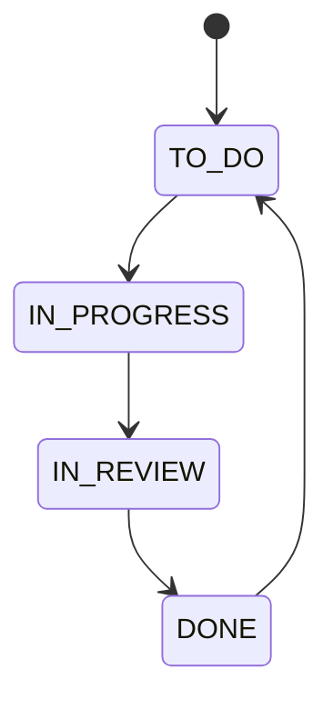

# Adoption publishing child fixture

This child page is linked to its [parent article]({{PARENT_ARTICLE_URL}}) and
keeps the same Git-authoritative publishing model. This correction was made in
Git first and then republished to the existing YouTrack article.

The separately attached diagram source is `trial-flow.mmd`.

## Source record

- Repository: `git@github.com:gfb64/devtools-youtrack.git`
- Path: `docs/knowledge/adoption-publishing-child.md`
- Commit: `{{SOURCE_COMMIT}}`
