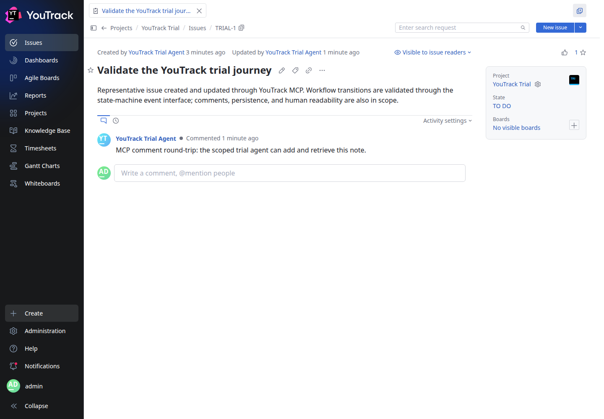
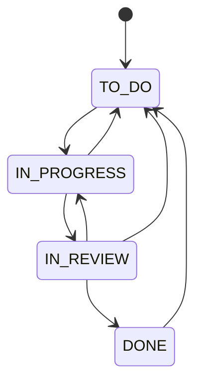

# YouTrack trial guide

This page is the Git-controlled source for the trial Knowledge Base article.
YouTrack is a readable copy for human review; corrections belong here first.

## Open the trial

Visit [dev-tools.helix-onprem.net](http://dev-tools.helix-onprem.net:8080) from the
Mac or workstation VM. Sign in with the trial administrator account to review the
project, or use the restricted agent token for supported API and MCP operations.

The representative issue is [TRIAL-1](http://dev-tools.helix-onprem.net:8080/issue/TRIAL-1).

## Workflow

The `State` field uses a visual state-machine workflow. New work starts in `TO DO`.
Only the arrows below are permitted.

The diagram source is also stored separately at `docs/diagrams/trial-flow.mmd` for
tools that consume Mermaid directly.

## Evidence so far

- The scoped `trial-agent` can read the project, create and update an issue, and add
  and retrieve a comment through YouTrack's native MCP server.
- The same token receives `403 Forbidden` from database-backup administration.
- All seven allowed workflow edges succeeded through the state-machine event
  interface. `TO DO` directly to `DONE` was rejected and the issue stayed in
  `TO DO`.
- The native MCP `update_issue` operation can set the raw `State` value without using
  a state-machine event. Treat this as a material trial limitation: agent state
  changes need a guardrail or an upstream fix before production use.

## Source authority

- Repository: `/home/ai/Development/devtools-trial`
- Branch: `trial/youtrack-evaluation`
- Source: `docs/trial-guide.md`
- Runtime: YouTrack `2026.2.18991` on x86_64 Ubuntu

The derived YouTrack article records the exact Git commit used when it is published.
